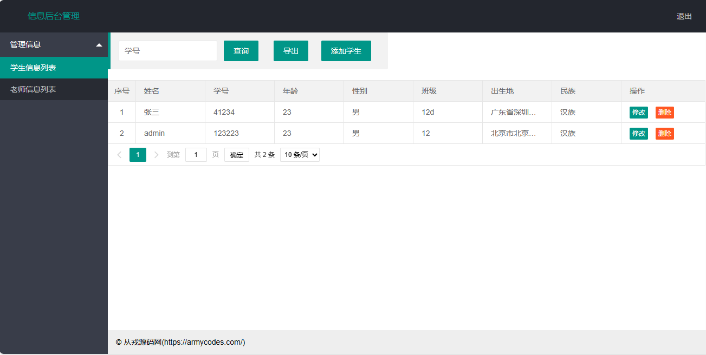

<h1 align="center">25.基于servlet的学生信息管理</h1>

- <b>完整代码获取地址：从戎源码网 ([https://armycodes.com/](https://armycodes.com/))</b>
- <b>技术探讨、资料分享，请加QQ群：692619798</b> 
- <b>作者微信：19941326836  QQ：952045282</b> 
- <b>承接计算机毕业设计、Java毕业设计、Python毕业设计、深度学习、机器学习</b>
- <b>选题+开题报告+任务书+程序定制+安装调试+论文+答辩ppt 一条龙服务</b>
- <b>所有选题地址 ([https://github.com/YuLin-Coder/AllProjectCatalog](https://github.com/YuLin-Coder/AllProjectCatalog)) </b>

## 项目介绍

基于servlet的学生信息管理系统：前端 html、jquery、layui，后端 servlet，一个简洁的学生信息、教师信息管理系统

## 主要功能

- 基本功能：登录、退出、注册
- 学生信息管理：根据学号查询、学生列表、添加学生、学生信息修改、学生信息删除、学生信息导出
- 教师信息管理：根据姓名查询、教师列表查询、添加教师、教师信息修改、教师信息删除

## 环境

- <b>IntelliJ IDEA 2009.3</b>

- <b>Mysql 5.7.26</b>

- <b>Tomcat 7.0.73</b>

- <b>JDK 1.8</b>

## 运行截图

