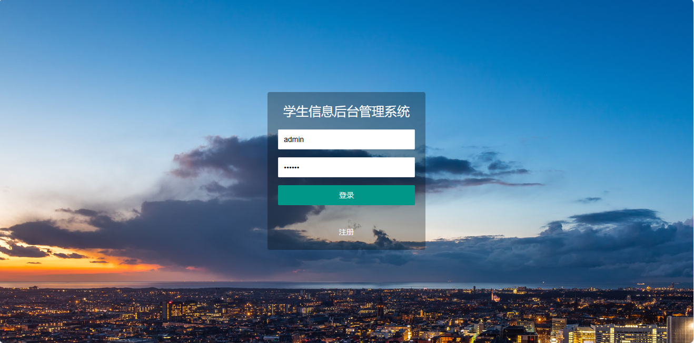

<h1 align="center">25.基于servlet的学生信息管理</h1>

 获取sql文件 QQ: 386869957 QQ群: 377586148 

 [推荐站点: 从戎源码网](https://armycodes.com/) 

## 简介

> 本代码来源于网络,仅供学习参考使用!
>
> 提供1.远程部署/2.修改代码/3.设计文档指导/4.框架代码讲解等服务
>
> 登录地址: http://localhost:8080/
> 
> 用户名: admin 密码: 123456

## 项目介绍

基于servlet的学生信息管理系统：前端 html、jquery、layui，后端 servlet，一个简洁的学生信息、教师信息管理系统

## 主要功能

- 基本功能：登录、退出、注册
- 学生信息管理：根据学号查询、学生列表、添加学生、学生信息修改、学生信息删除、学生信息导出
- 教师信息管理：根据姓名查询、教师列表查询、添加教师、教师信息修改、教师信息删除

## 环境

- <b>IntelliJ IDEA 2009.3</b>

- <b>Mysql 5.7.26</b>

- <b>Tomcat 7.0.73</b>

- <b>JDK 1.8</b>

## 运行截图

